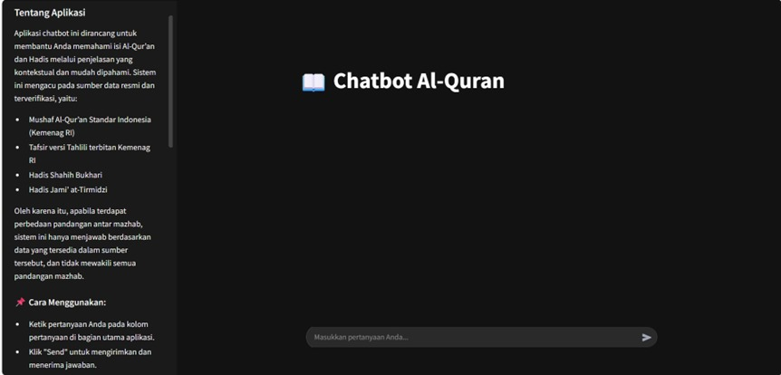

# GraphRAG with Al-Quran and Hadith

This project demonstrates a Retrieval-Augmented Generation (RAG) system built on a graph database to explore and query texts from the Al-Quran and Hadith. It leverages the power of graph structures, vector embeddings, and large language models to provide insightful and context-aware answers.


## 🚀 About The Project

This application implements a dual-search mechanism to retrieve relevant information:

1.  **Vector Search:** Utilizes semantic similarity to find nodes (e.g., verses, hadiths) that are contextually related to the user's query.
2.  **Graph Traversal:** Explores the explicit relationships and connections between entities within the knowledge graph, uncovering deeper context that vector search alone might miss.

The retrieved context from both search methods is then synthesized by a Large Language Model (LLM) to generate a comprehensive and accurate response.

***

## 🛠️ Tech Stack

This project is built with a modern stack designed for high-performance AI applications:

* **Database:** **Neo4j 5.42** for robust and scalable graph data management.
* **Embedding Model:** **GTE-Qwen-7B** to generate powerful and semantically rich vector embeddings for the text.
* **LLM Provider:** **Groq Cloud** for ultra-fast inference, featuring the **Llama 3** model for state-of-the-art text generation.

***

## ✨ Features

* **Knowledge Graph:** Represents the Al-Quran and Hadith as an interconnected graph of verses, chapters, narrators, and topics.
* **Dual Search Retrieval:** Combines vector and graph search for superior context retrieval.
* **High-Speed Generation:** Delivers real-time answers using the Groq LPU™ Inference Engine.
* **Intuitive UI:** A clean interface to ask questions and explore the graph's insights.

***

## ⚙️ Getting Started

To get a local copy up and running, follow these simple steps.

### Prerequisites

Make sure you have the following installed and configured:

* **Python 3.9+**
* **Neo4j Desktop** or a running Neo4j 5.42 instance.
* A **Groq Cloud account** to obtain an API key.

### Installation

1.  **Clone the repository:**
    ```sh
    git clone [https://github.com/rakamhrdka10/GraphRAGAlquranAndHadith.git](https://github.com/rakamhrdka10/GraphRAGAlquranAndHadith.git)
    cd GraphRAGAlquranAndHadith
    ```

2.  **Install Python dependencies:**
    ```sh
    pip install -r requirements.txt
    ```

3.  **Set up environment variables:**
    Create a `.env` file in the root directory and add your credentials. You can get your API key from the [Groq Cloud console](https://console.groq.com/keys).

    ```env
    # .env file

    # Neo4j Credentials
    NEO4J_URI="bolt://localhost:7687"
    NEO4J_USERNAME="neo4j"
    NEO4J_PASSWORD="your-neo4j-password"

    # Groq Cloud API Key
    GROQ_API_KEY="gsk_xxxxxxxxxxxxxxxxxxxxxxxxxxxxxxxxxxxxxxxx"
    ```

4.  **Run the application:**
    ```sh
    python app.py
    ```

***

## 🖼️ User Interface

The UI is designed for simplicity and ease of use. Users can input a question in the chat interface and receive a generated answer along with the sources used for retrieval.


